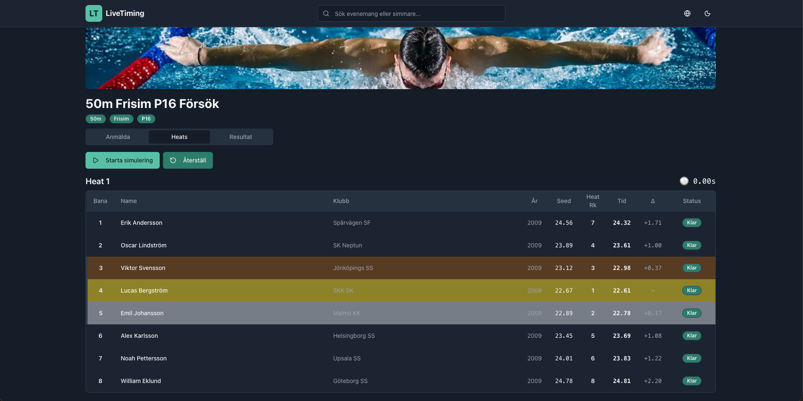
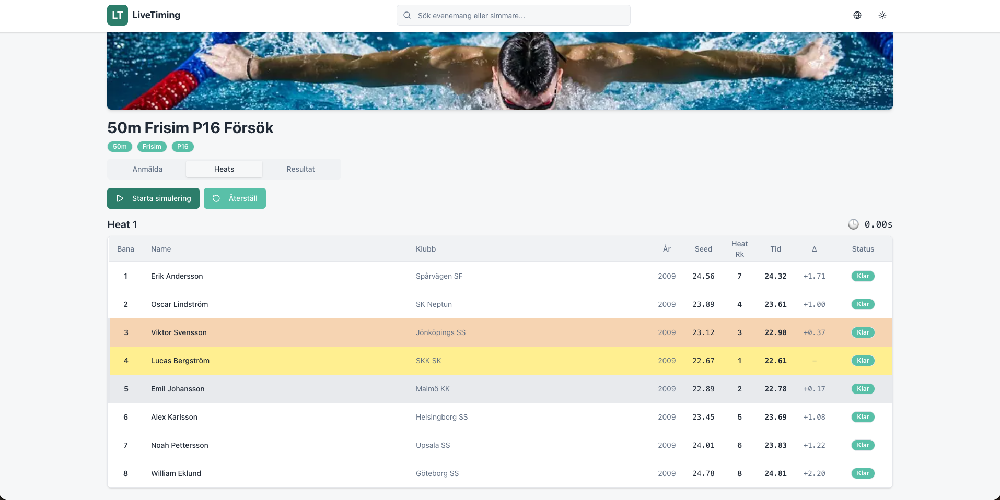

# Swim live demo

A minimal swim meet viewer and simulator built with **Next.js**, **TypeScript**, **Apollo Client**, and **GraphQL Yoga**.  
The app simulates live swimming heats with real-time lane updates and result rankings.

---

## Live Demo

**Production:** [https://swim-live-demo.vercel.app/](https://swim-live-demo.vercel.app/)  

## Screenshots

## Quick Demo Path

Home -> choose a meet -> pick a heat -> start heat simulation -> watch live table -> view heat results

---

## Features

- Browse swim meets, sessions, events, and heats  
- Start a heat simulation and see lanes progress in real time  
- View final ranked results

---

## How It Works

- The backend is a **GraphQL Yoga** API served from `/api/graphql`
- Data is provided from mock in-memory storage (`mockData.ts`)
- Starting a heat triggers simulated progression of lane times  
- Once all lanes are finished, results are ranked and stored temporarily in memory

---

## Tech Stack

- **Framework:** Next.js 16  
- **Language:** TypeScript  
- **UI:** React + Tailwind CSS + Framer Motion  
- **Data Layer:** Apollo Client (GraphQL)  
- **API:** GraphQL Yoga (Next.js Route Handler)  
- **Hosting:** Vercel  

---

## Notes

- All data is **in-memory** and resets if the server restarts  
- No environment variables or setup are required  
- GraphiQL playground is available at  
  [`/api/graphql`](https://swim-live-demo.vercel.app/api/graphql)  